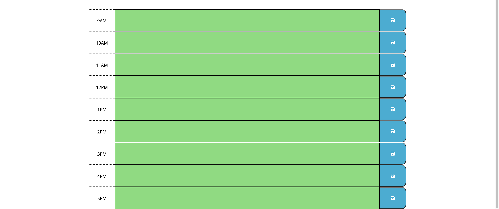

# Work Day Scheduler

Have you ever wanted to plan out your work day? Well you're in luck because this application allows you, the user, to organize a schedule that is suitable for a 9 AM to 5 PM work schedule. How this application works is allowing the user to take down notes on certain hours of the day, which this application follows the user's date and time to fit their note-taking experience, and keeps track of what needs to be done throughout the day. An amazing feature that this application also has in store is saving the note-taking process and keeps the user's notes saved through the user's device so that no progress can be lost when getting off or refreshing the application.


## Direct Link to Deployed Page

https://ricky22m.github.io/Work-Day-Scheduler/

## Repository Link

[Link to  GitHub Repository](https://github.com/Ricky22M/Work-Day-Scheduler)

## User Story

```md
AS AN employee with a busy schedule
I WANT to add important events to a daily planner
SO THAT I can manage my time effectively
```

## Acceptance Criteria

```md
GIVEN I am using a daily planner to create a schedule
WHEN I open the planner
THEN the current day is displayed at the top of the calendar

WHEN I scroll down
THEN I am presented with timeblocks for standard business hours

WHEN I view the timeblocks for that day
THEN each timeblock is color coded to indicate whether it is in the past, present, or future

WHEN I click into a timeblock
THEN I can enter an event
WHEN I click the save button for that timeblock
THEN the text for that event is saved in local storage
WHEN I refresh the page
THEN the saved events persist
```

## Step One

```md
WHEN I open the planner
THEN the current day is displayed at the top of the calendar
```


In these two images we are able to see that the current user date is being applied through the JavaScript onto the HTML using Moment.JS to get the user's current time and date.

## Step Two

```md
WHEN I scroll down
THEN I am presented with timeblocks for standard business hours
```

.png)
.png)


In the first two images above, the code that is being provided in HTML is creating the time blocks that are shown onto to the webpage display. We are also able to see the kinds of classes within the different time blocks that are being used to create a quick, easy, and slick design with the use of bootstrap. Also keeping in mind that not all the classes within the divs are being used for CSS but also for JavaScript. Finally, the third image displays the effectiveness of bootstrap and how useful it can be by creating timeblocks within the body of the HTML.

## Step Three

```md
WHEN I scroll down
THEN I am presented with timeblocks for standard business hours
```


D

## Step Four

```md
WHEN I scroll down
THEN I am presented with timeblocks for standard business hours
```


D

## Step Fivw

```md
WHEN I scroll down
THEN I am presented with timeblocks for standard business hours
```


D

## Step Six

```md
WHEN I scroll down
THEN I am presented with timeblocks for standard business hours
```


D
