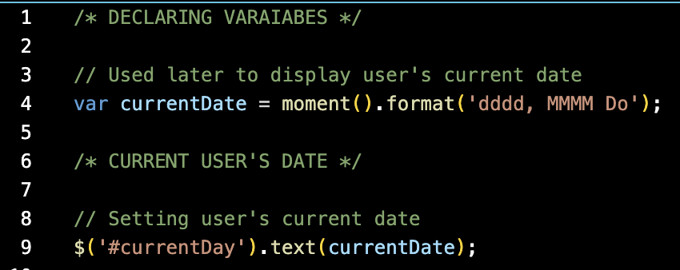

# Work Day Scheduler

Have you ever wanted to plan out your work day? Well you're in luck because this application allows you, the user, to organize a schedule that is suitable for a 9 AM to 5 PM work schedule. How this application works is allowing the user to take down notes on certain hours of the day, which this application follows the user's date and time to fit their note-taking experience, and keeps track of what needs to be done throughout the day. An amazing feature that this application also has in store is saving the note-taking process and keeps the user's notes saved through the user's device so that no progress can be lost when getting off or refreshing the application.


## Direct Link to Deployed Page

https://ricky22m.github.io/Work-Day-Scheduler/

## Repository Link

[Link to  GitHub Repository](https://github.com/Ricky22M/Work-Day-Scheduler)

## User Story

```md
AS AN employee with a busy schedule
I WANT to add important events to a daily planner
SO THAT I can manage my time effectively
```

## Acceptance Criteria

```md
GIVEN I am using a daily planner to create a schedule
WHEN I open the planner
THEN the current day is displayed at the top of the calendar
WHEN I scroll down
THEN I am presented with timeblocks for standard business hours
WHEN I view the timeblocks for that day
THEN each timeblock is color coded to indicate whether it is in the past, present, or future
WHEN I click into a timeblock
THEN I can enter an event
WHEN I click the save button for that timeblock
THEN the text for that event is saved in local storage
WHEN I refresh the page
THEN the saved events persist
```

## Step One

```md
WHEN I open the planner
THEN the current day is displayed at the top of the calendar
```




In these two images we are able to see that the current user date is being applied through the JavaScript onto the HTML using Moment.JS to get the user's current time and date.

## Step Two

```md
WHEN I scroll down
THEN I am presented with timeblocks for standard business hours
```

.png)
.png)


In the first two images above, the code that is being provided in HTML is creating the time blocks that are shown onto to the webpage display. We are also able to see the kinds of classes within the different time blocks that are being used to create a quick, easy, and slick design with the use of bootstrap. Also keeping in mind that not all the classes within the divs are being used for CSS but also for JavaScript. Finally, the third image displays the effectiveness of bootstrap and how useful it can be by creating timeblocks within the body of the HTML.

## Step Three

```md
WHEN I view the timeblocks for that day
THEN each timeblock is color coded to indicate whether it is in the past, present, or future
```


 ---- NEED TO FIX HERE

In te first image above we can see that the code we are using to change the hour time blocks periodically based on the the user's current time when certain conditions are being met. Also in the last image we see that their are the three classes in the code that are being shown which is the past, present, and the future with the colors representing each hourly period. The past hours are being represented with the color gray, the present hour is being represented with the color red, and the future hours to come are represented with the color green.

## Step Four

```md
WHEN I click into a timeblock
THEN I can enter an event
```


 ---- NEED TO FIX HERE

As you can see in the Step Four code that all time blocks from 9AM - 5PM all have the "textarea" element which allows user input to be inputted through the use of text, though it is not saved simply because the user inputs text, but when the user clicks on the save button next to the "textarea" HTML element. In the second image provided above, we are able to see that the user is indeed able enter an event on which ever time block they wish to.

## Step Fivw

```md
WHEN I click the save button for that timeblock
THEN the text for that event is saved in local storage
```


 ---- NEED TO FIX HERE

The step Five that is being provided shows that the user is able to click the save button and a function will run. When the button is clicked, then the div for which the user has clicked the save button through will save with the id that was given through that div as a time block. As the button is clicked, the jquery function will run and try to find the class named "description" and save it's key value which is also within the same div that the id was in. Now as the id is saved and the value of the description is being saved, we set the IDs as keys to the values with their given description. Both the keys (the IDs) and values (descriptions) are being set and saved onto local storage. Finally, as you can see in the next image below, how the keys and values are being saved through local storage through the application.

## Step Six

```md
WHEN I refresh the page
THEN the saved events persist
```


 ---- NEED TO FIX HERE

Finally at Step Six, we have to save and load all of our information that we saved through local storage. In the code provided above, we see that I used the same pattern of code to load each and every different and seperate id for each of the time blocks with their given information. Also notice that only the keys and values are being saved, however, not the color of time is being shown along with the saved data. Lastly in the GIF above shows how the information above is being saved and loaded back by refreshing the webpage of the deployed application.